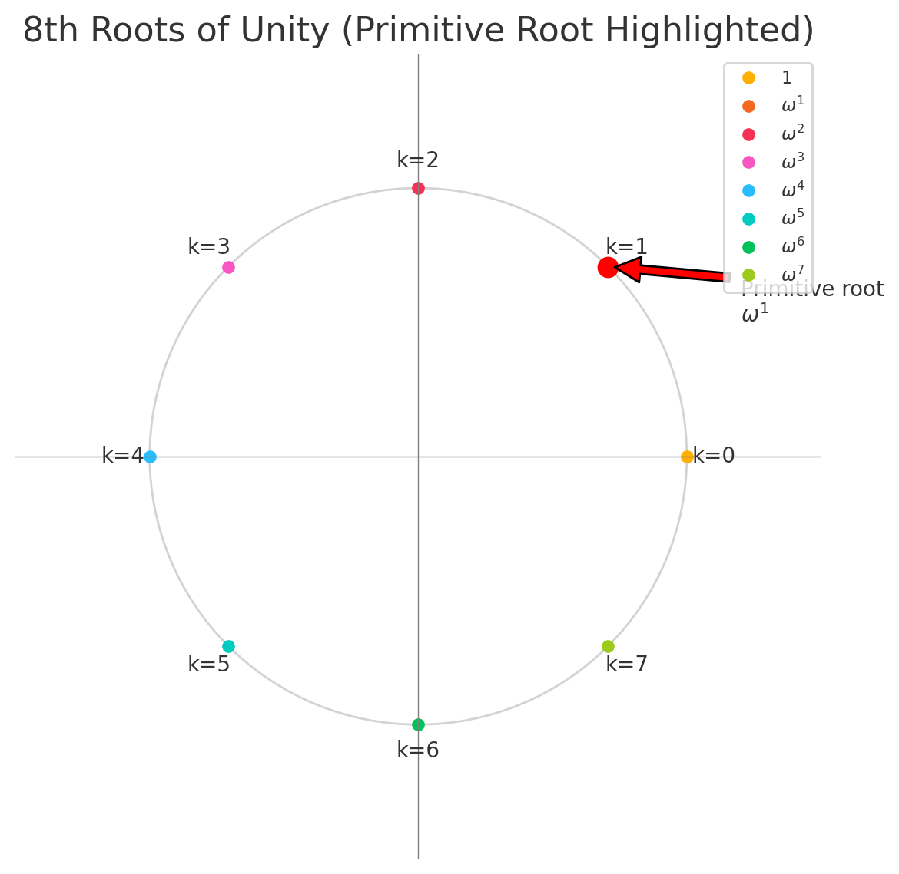

# The Fast Fourier Transform and Number Theoretic Transform for efficient Polynomial evaluations
The Fast Fourier Transform is an efficient algorithm to compute the [Discrete Fourier Transform (DFT)](https://en.wikipedia.org/wiki/Discrete_Fourier_transform). 

It can be used to convert a polynomial from its coefficient representation to its value representation, by evaluating the polynomial at complex points. The reason why the implementation of the FFT algorithm is possible is because we perform a frequency analysis of our inputs for a very specific domain called the `roots of unity`. 

Which allows us to write a recursive algorithm that reduces our problem by repeatedly halving our input domain, by splitting it into even and odd pairs.

Feel free to revisit this equality after reading the entire article, by then you should have a good understanding of what `roots of unity` are 
and how we use them depending on our context / input data.

This article strives to strike a balance between theory and implementation, making the use of FFT in polynomial commitment schemes like STARKs more clear to both engineers and mathematicians, whilst avoiding oversimplification and abstraction of the underlying ideas. View this article as a combination of background information and code documentation.

## Prerequisite Knowledge
- Algorithms
- Finite Field Arithmetic

## Roots of Unity
### Complex Roots of Unity
In order to apply FFT to the input vector that contains a signal that we want to analyze using FFT, we should pad our input to a power of 2:

```
[3,2,1,0] # some example input, could be measurement results (signal amplitude over time)
```

we must compute our roots of unity for the input domain of size n:

```
ω^k = e^(-2πik / N) = cos(2πk/N) - i sin(2πk/N)
```
We see immediately that 2π represents a full rotation of 360°. Our roots of unity are spaced points on the unit circle from 0 to 360, representing a full revolution and allowing us to analyze the input signal based on the resolution defined by the size of our inputs.

But what is the complex number `i`? As a computer scientist this concept is difficult to understand, but `i` is no more than a notation trick used by mathematicians to represent our result for ω as a 2D point with a sin and cos component. In a computer environment we will separate these components and compute the sin and cos parts separately. Once done we can collect our results into a complex number structure (real, imaginary). 

As an engineer I am not too fond of the idea of complex numbers, because in a computer representation they are nothing but 2D vectors or tuples. The reason this is important is because we want to represent a full rotation around the unit circle, where each step evenly advances the angle. 

>[!NOTE]
> This statement about i is not 100% true, because while addition works
> the same for complex numbers not all arithmetic is the same for complex numbers.
> Multiplication for example works slightly differently.
> However it is possible to represent the complex number as a 2D vector and 
> apply the correct arithmetic to each of the 2 parts.

**Illustration of a case where n=8**:




### Roots of Unity in a Finite Field
When operating over a finite field instead of the complex number plane,
we compute our primitive root of unity differently. This is because instead
of a full rotation around the unit circle we now want to represent a cyclic group
that wraps around n elements in the field and repeats every n steps.

FFT over a finite field modulo `p` is referred to as NTT (Number Theoretic Transform).
The underlying algorithm is the same as for FFT, but there are important differences in 
how the roots of unity are defined.

We can compute our primitive root of unity for a finite field given:

- A prime `p` such that `n` divides `(p - 1)`
- A generator `g` of the multiplicative group `F_p*`

using:

```
ω0 = g^((p - 1) / n) mod p
```

The generator `g` of a multiplicative subgroup of a finite field itself must satisfy:

```
g^k != 1 mod p for all 0 < k < p−1 and g^(p-1) = 1 mod p
```

There are good resources online explaining how and why to obtain such a generator in more depth, but since this is not the focus of this article we will stop here with the definition.

### Frequency
Now that we have some intuition for roots of unity it is a good point in time to take a look at the core algorithm that is used to describe the FFT.

For now we won't take a look at complex numbers and assume operations over a finite field. Complex numbers are a confusing concept so let's get back to them once we have understood the core mechanism that happens in the FFT algorithm.

```
X[k] = ∑(n = 0 to n - 1) x[n] * ω^(k * n)
```

X[k] describes how much of the frequency pattern `k` is present in all of our input elements. What this means for polynomial evaluations is that instead of finding a `y` result for
our `x` term, we analyze the frequency of each frequency pattern in our coefficients.

It's important to keep in mind that each polynomial is unique and therefore each frequency
analysis of a set of coefficients is unique as well. 

## FFT in signal Processing
FFT is used heavily in signal processing. The core idea is to measure a signal's amplitude over 
a set interval of time, producing n measured values. Those n values are then the input to our FFT and are used together with the corresponding roots of unity.

If we sample the signal for longer (increase N), we improve frequency resolution. Higher resolution however makes it more difficult to tell when exactly a given signal occurred. While this requires careful handling when dealing with signals, it is not a concern when evaluating polynomials, which is the focus of this article.

## Evaluating Polynomials using NTT
When we apply the NTT formula, starting with our primitive root of unity ω0:
```
X[k] = ∑(n = 0 to n - 1) x[n] * ω^(k * n)
```

Our result is a list of n values X[k] that are our polynomial evaluations over the 
domain of roots of unity.

When we apply NTT to 2 distinct polynomials, we can use their newly found value representation
to perform arithmetic such as addition, multiplication and inverse multiplication (=division) to find solutions for real problems.

Once we have applied our arithmetic, we perform INTT / IFFT (the inverse NTT algorithm), which is exactly the same as the regular NTT / FFT except that we take the inverse of each of our roots of unity  ω^-1 and normalize the result. In order to normalize the result we have to divide by n. 

We can think of our result X[k] as a share in a pool of accumulated values and when performing IFFT or INTT we redeem our contributions from that pool for each frequency `k`. While we generally avoid abstraction this analogy can help you further explore the idea of chunking frequencies in FFT / NTT.

## Iterative FFT implementation
Finally, in order to be able to apply FFT / NTT in a computer science context, we must take a look at the implementation of the algorithm. We can choose between a recursive and iterative implementation, but this article will cover only the iterative implementation. The reason for this is that recursive algorithms are not GPU-friendly and in order to gain the maximum performance from our FFT we will likely want to parallelize it. 

Here is a Rust implementation of FFT, with a boolean flag indicating if we are applying FFT or the inverse FFT (IFFT):

```rust
pub fn fft_iterative(mut values: Vec<Complex>, invert: bool) -> Vec<Complex> {
    let n = values.len();
    assert!(n.is_power_of_two());

    // Bit reversal permutation to account for the traversal
    // order in recursive FFT
    // This property emerges naturally
    let mut j = 0;
    for i in 1..n {
        let mut bit = n >> 1;
        while j & bit != 0 {
            j ^= bit;
            bit >>= 1;
        }
        j ^= bit;

        if i < j {
            values.swap(i, j);
        }
    }

    let pi = std::f64::consts::PI;
    let sign = if invert { 1.0 } else { -1.0 };

    // FFT Butterfly loop
    let mut len = 2;
    while len <= n {
        let angle = 2.0 * pi / (len as f64) * sign;
        let wlen = Complex {
            real: f64::cos(angle),
            imaginary: f64::sin(angle),
        };

        for i in (0..n).step_by(len) {
            let mut w = Complex {
                real: 1.0,
                imaginary: 0.0,
            };
            for j in 0..len / 2 {
                // even index part
                let u = values[i + j];
                // odd index part
                let v = w * values[i + j + len / 2];
                // keep rotation as-is
                values[i + j] = u + v;
                // 180° flip
                values[i + j + len / 2] = u - v;
                w = w * wlen;
            }
        }

        len *= 2;
    }

    if invert {
        for x in values.iter_mut() {
            *x = x.scale(1.0 / n as f64);
        }
    }

    values
}
```

The twiddle factor `w = e^{-2πik/n}` is our complex rotation factor on the unit circle, ranging from 0 to a full rotation of 360°.
`v` is the result of our current odd-index value multiplied by `w`. Only the odd parts need to be rotated, the even parts
go straight into the sum, since they are already aligned on the unit circle.

Now let's consider this equality for even and odd indices:
`e^(-2πik(2j + 1)/n) = e^(-2πik(2j)/n) * e^(-2πik/n)`

The performance advantage of FFT comes from our ability to re-use evaluations from previous DFTs at given pairs of even/odd indices.
In particular, the part that is re-usable is `e^(-2πik(2j)/n)` and all previous evaluations.

The 180° (`-1`) phase flip is **not** pairing an even input with its odd input,
it is applied only to the odd-path contribution so the butterfly can generate the second frequency bin `k + n/2`.  
In other words, one rotated odd term feeds two outputs: `u + v` for bin `k`, and `u - v` for the bin that sits exactly π radians (180°) 
farther around the unit circle.

The `-1` comes from our spacing by `n/2`:

```
W_n^(k + n/2) = W_n^k * W_n^(n/2)
W_n^(n/2) = e^(-2πi·(n/2)/n) = e^(-πi) = -1
```

Now you should see that even indices always correspond to the first half in our bit-adjusted list and odd indices correspond to the second half.
We always pair one element from the first half with one element from the second half in the recursive process that re-uses the values from
the previous step all the way up to our result.

## Context in STARK proving systems
Now that we have a decent understanding of FFT / NTT and hopefully also know what we don't yet fully understand and have the ability to dive deeper on demand, let's explore the real-world application of NTT that was my motivation to even write this article and dive deep into the math and underlying algorithms.

NTT is used in STARK proving systems that rely on polynomial commitment schemes by interpolating (using INTT) and folding polynomials. Now what does it mean to interpolate a polynomial? It simply means to use an algorithm like INTT to convert from the value representation (points on the polynomial) to the coefficient representation (`2x^2 + 3x + 1`, o.e.). 

Folding with NTT is a bit more complicated than interpolation, but it is one of the most important optimizations used in production-grade, multi-million-dollar proof systems. We won't dive deep into the folding scheme used specifically in those proof systems, but they always rely on the division of polynomials. And division of polynomials is something that can be efficiently done by first performing NTT on each polynomial's inputs, then dividing one polynomial by the other and finally interpolating our result with INTT.

However the division must be done modulo `p`, meaning we have to use inverse multiplication to achieve the correct results. 

>[!NOTE]
> This is not the case when using the complex number roots of unity in FFT, 
> but is always the case when using NTT over a finite field.


## Real-World Impact
In order to improve ZK STARK protocols, industry-level players like [Succinct](https://github.com/succinctlabs) and [Risc0](https://github.com/risc0/risc0) leverage hardware acceleration. Many of these hardware accelerations are for specific higher-level algorithms like hash functions and signature schemes, but the NTT/FFT is fundamental to the protocol itself and required for any STARK proof, regardless of the libraries used in a DSL or Rust circuit. Therefore the value of parallelizing the FFT algorithm in cuda, metal, OpenCL and further optimizing it is enourmous to the industry.

For those working on STARK proof systems the hardware acceleration of NTT is a major milestone in achieving better performance. 

## Credits
This article was entirely written word-by-word by [Jonas Pauli](https://www.linkedin.com/in/jonas-pauli/), without the use of AI (except for correcting spelling mistakes).

All illustrations used in this article (picture of unit circle, ...) were generated with ChatGPT.

Checkout [Ciphercurve](https://ciphercurve.com), we have an open-source STARK implementation called `Toyni`.